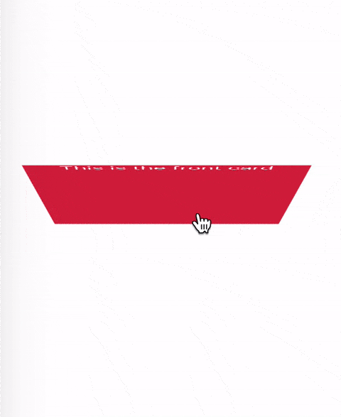
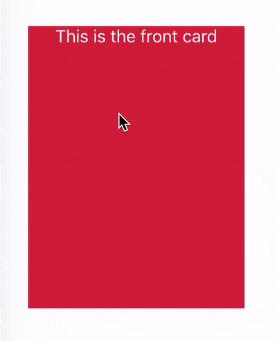

# Introduction

Simple FlipCard React Component

`npm i react-flip --save`

# Demo





# Usage

`FlipCard` required a prop `flipped` to flip the card when users click on the card.

```javascript
import React from 'react';
import FlipCard from 'react-flip';
import './App.css';

const BackCardContent = () => (
  <div>
    <h2>This is the back card component</h2>
  </div>
);

class App extends React.Component {
  state = {
    flipped: false
  };

  handleCardClick = () => {
    this.setState(prevState => ({
      flipped: !prevState.flipped
    }));
  };

  render() {
    return (
      <div className="App">
        <FlipCard
          cardContainerStyle={{ color: 'white', padding: '10px' }}
          flipped={this.state.flipped}
          onCardClick={this.handleCardClick}
          backContent={<BackCardContent />}
          frontContent="This is the front card"
        />
      </div>
    );
  }
}

export default App;
```

#Props

| Name           | type                      | Default                   | isRequired | Description                                |
| -------------- | ------------------------- | ------------------------- | ---------- | ------------------------------------------ |
| flipped        | Bool                      | false                     | Yes        | props to know when to flip card            |
| onCardClick    | Func                      | No                        | Yes        | callback func when users click on the card |
| frontContent   | String or React Component | No                        | Yes        | front card content
| backContent    | String or React Component | No                        | Yes        | back card content
| width          | String                    | 200px                     | No         | width of the card
| height         | String                    | 260px                     | No         | height of the card
| horizontal     | Bool                      | false                     | No         | make the card flip horizontally, default is vertical flip
| frontCardStyle | Object                    | { background: '#d41f42' } | No         | front card styling
| backCardStyle  | Object                    | { background: '#2e508b' } | No         | back card styling                                           |
| perspective    | String                    | 1000px                    | No         | perspective given on the container that would make 3D space 
